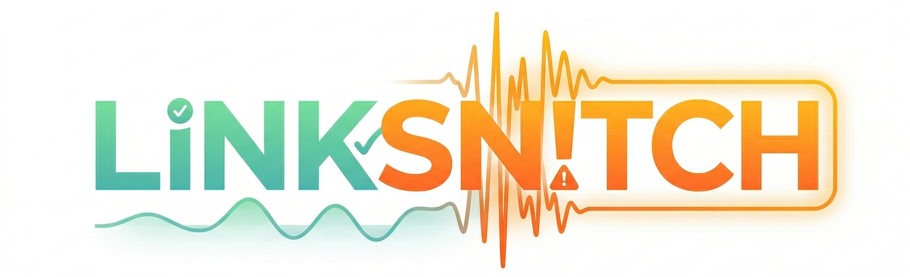
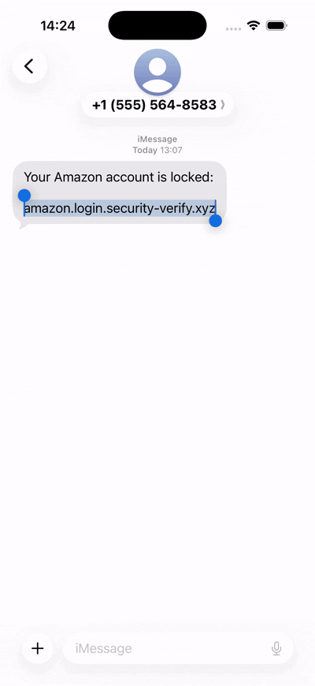
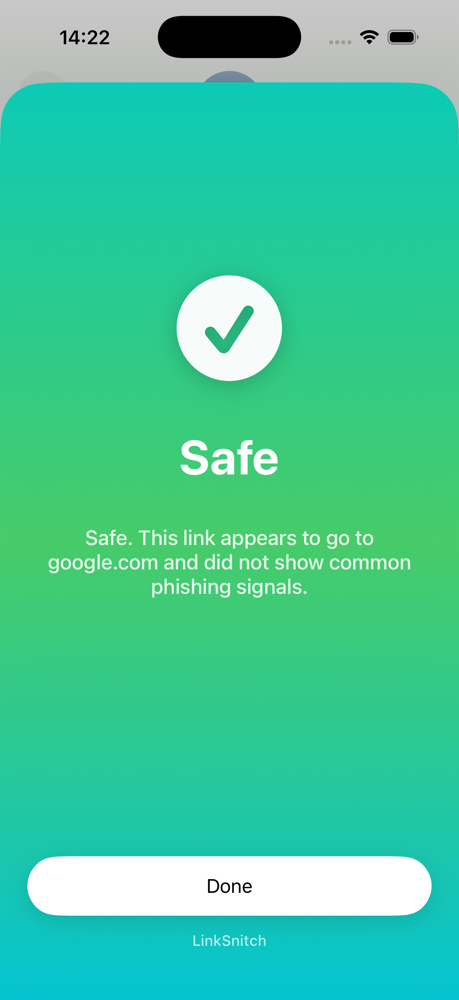
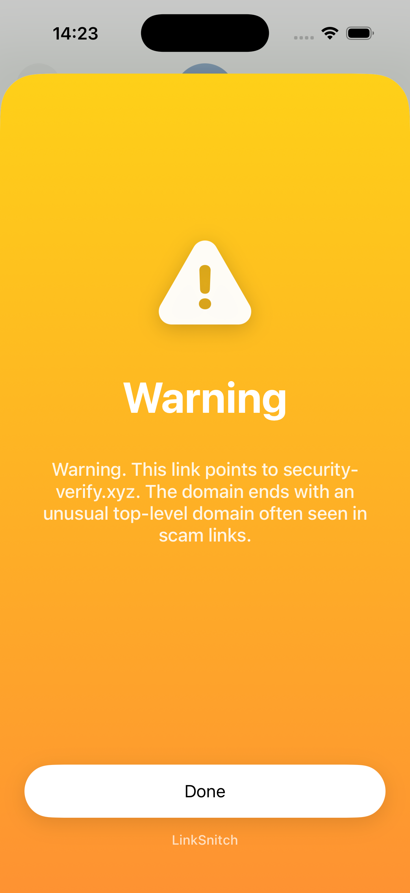

  

  Instantly understand if a link is safe — before you open it.

---

## Demo

  

## Results

  
  

## What it does

LinkSnitch is an iOS app that checks links before you open them.

It gives:
- a clear **Safe** or **Warning** result
- a short explanation
- spoken feedback

## Features

- iOS **Share Extension**
- bold full-screen **Safe / Warning** UI
- **voice feedback** with text-to-speech
- minimal **history** of recent checks
- fast on-device analysis

## How it works

1. Share a link to LinkSnitch
2. The app extracts the real destination
3. It checks for phishing signals
4. It shows and reads the result

## Detection signals

- domain mismatch
- suspicious TLDs
- excessive subdomains
- login / verify / secure patterns
- IP-based URLs
- punycode domains

## Tech

- Swift
- UIKit + SwiftUI
- AVSpeechSynthesizer
- iOS Share Extension
